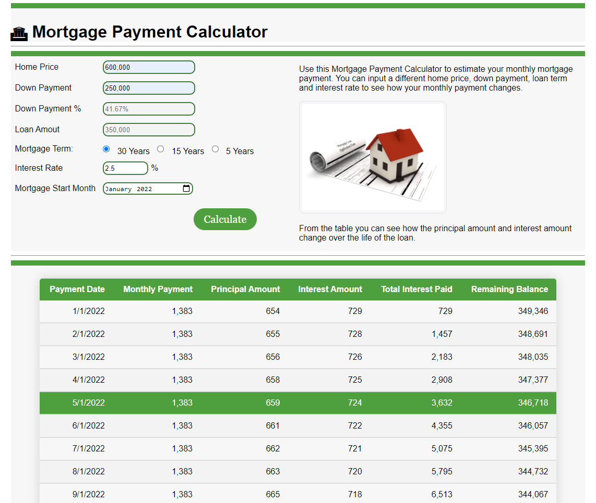

# Mortgage payment calculator app

This is an app used to calculate monthly mortgage payment based on house price, down payment, interest rate and mortgage terms. Each payment will be broken down into principal amount, interest portion, cumulative interest total amount, and remaining balance.

# Technology Used

HTML, CSS, JavaScript

# Application Interface

